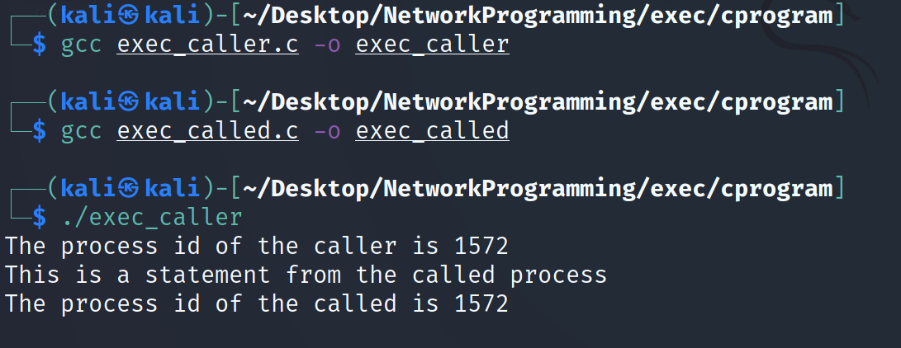

# Exec system call
The exec() family of function replaces the current image with the new process image.When exec is called the previous executable file is replaced with the new executable file.The exec system call will replace old file or program from the process with the new file or program.The entire content of the process is replaced with the new program.
The userdata segment which executes the exec() system call is replaced with the data file whose name is provided in the argument calling the exec() system call.The new program is loaded in the same process space hence the new process has the sampe process id. Exec() function call replaces the process with another process, the current process is turned into new process.

If the current process contains more than one thread then all of the threads are terminated and the new process image is loaded and executed.There are no destructor function that terminates the thread of current process.

While the PID of the process is not changed but the data, code, stack, heap etc. of the process are changed and are replaced with those of newly loaded process.The new process is executed from the entry point.

The exec system call are the collection of function and in **C programming language** the standard name of the function are as follows:
1. ececl
2. execle
3. execlp
4. ececv
5. execve
6. execvp


Avobe functions have same base as exec with some extra letters having these functions

**e**: It is an array of pointers that points to the environment variables and is passed explicitly to the newly loaded program

**P**: It is a path environment variable which helps to find the file passed as an argument to be loaded into process.

**v**: It is for command line arguments.These are passed as array of pointers to the functions.

**l**: It is used for passing a list to the functions. 

### Inner working of exec
1. Current process image is overwritten with new process image.
2. New process image is the one you passed as exec argument.
3. The current running process is ended.
4. The new process image has the same PID, environment, file descriptor.
5. The cpu stat and virtual memory is affected. Virtual memory maping of current process image is replaced by virtual memory of new process image.

### Syntax of exec family of functions:

The following are the syntax:

```
int execl(const char* path, const char* args,....)
int execlp(const char* file, const char* args,....)
int execle(const char* path, const char* args,..., char* const, envp[])
int execv(const char* path, const char* argv[])
int execvp(const char* fiel, const char* argv[])
int execvpe(const char* fiel, const char* argv[], char* const ,envp[])
```
#### Description

The return type of this function is int.when the process image is sucessfully replaced


1. path is used to specify the full path name of the file which is to be executes.

2. arg is the argument passed. It is actually the name of the file which will be executed in the process. Most of the times the value of arg and path is same.

3. const char* arg in functions execl(), execlp() and execle() is considered as arg0, arg1, arg2, …, argn. It is basically a list of pointers to null terminated strings. Here the first argument points to the filename which will be executed as described in point 2.

4. envp is an array which contains pointers that point to the environment variables.

5. file is used to specify the path name which will identify the path of new process image file.

6. The functions of exec call that end with e are used to change the environment for the new process image. These functions pass list of environment setting by using the argument envp. This argument is an array of characters which points to null terminated String and defines environment variable.


#### Example 1: Using exec system call in c programming

##### exec_caller.c
```
#include<stdio.h>
#include<unistd.h> //This header file includes exec calls
#include<stdlib.h>
int main (int argc, char *argv[]){
printf("The process id of the caller is %d\n",getpid());
char *args[]={"./exec_called",NULL};
execv(args[0],args);
printf("Exec system call have been executed");//this will not execute
return 0;
}
```

##### exec_called.c
```
#include<stdio.h>
#include<unistd.h> //This header file includes exec calls
#include<stdlib.h>
int main (int argc, char *argv[]){
printf("This is a statement from the called process\n");
printf("The process id of the called is %d",getpid());
return 0;
}
```
**OUTPUT**


In the above example we have an exec_caller.c file and exec_called.c file. In the exec_caller.c file first of all we have printed the ID of the current process . Then in the next line we have created an array of character pointers(char *args[]={"./exec_called",NULL};). The last element of this array should be NULL as the terminating point.

Then we have used the function execv() which takes the file name and the character pointer array as its argument. It should be noted here that we have used ./ with the name of file, it specifies the path of the file. As the file is in the folder where exec_caller.c resides so there is no need to specify the full path.

When execv() function is called, our process image will be replaced now the file exec_caller.c is not in the process but the file exec_called.c is in the process. It can be seen that the process ID is same whether exec_caller.c is process image or exec_called.c is process image because process is same and process image is only replaced.

Then we have another thing to note here which is the printf() statement after execv() is not executed. This is because control is never returned back to old process image once new process image replaces it. The control only comes back to calling function when replacing process image is unsuccessful. (The return value is -1 in this case).

