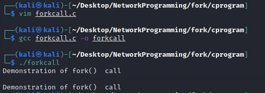
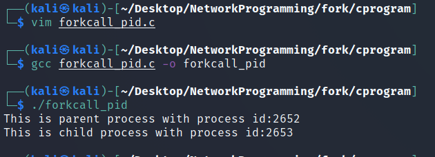
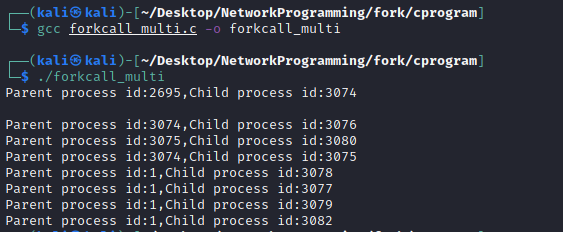

# Fork System Call
Fork system call is used for creating child process the runs cocurently with the parent process.After a new child process is created, both processes will execute the next instruction following the fork() system call. A child process uses the same pc(program counter), same CPU registers, same open files which use in the parent process.
The child process is exactly the same as its parent but there is difference in the processes ID’s:

   * The process ID of the child process is a unique process ID which is different from the ID’s of all other existing processes.
   * The Parent process ID will be the same as that of the process ID of child’s parent.


It returns an integer value but dosent take any argument.

**Negative value:** If child process creation was unsucessful.
**Positive value:** Returned to parent or caller.
**Zero:** Returned to newly created child process.

## Read the man page of Fork

```
man fork

NAME
       fork, wait, waitpid - basic process management

SYNOPSIS
       @load "fork"

       pid = fork()

       ret = waitpid(pid)

       ret = wait();

DESCRIPTION
       The fork extension adds three functions, as follows.

       fork() This  function  creates  a new process. The return value is the zero in the child and the process-id number of the child in the parent, or -1 upon error. In the latter case, ERRNO indicates the problem.  In the child,
              PROCINFO["pid"] and PROCINFO["ppid"] are updated to reflect the correct values.

       waitpid()
              This function takes a numeric argument, which is the process-id to wait for. The return value is that of the waitpid(2) system call.

       wait() This function waits for the first child to die.  The return value is that of the wait(2) system call.

BUGS
       There is no corresponding exec() function.

       The interfaces could be enhanced to provide more facilities, including pulling out the various bits of the return status.

EXAMPLE
       @load "fork"
       ...
       if ((pid = fork()) == 0)
           print "hello from the child"
       else
           print "hello from the parent"


   
```

###### Properties of Child Process

The following are some of the properties that a child process holds:

    1. The CPU counters and the resource utilizations are initialized to reset to zero.
    2. When the parent process is terminated, child processes do not receive any signal because PR_SET_PDEATHSIG attribute in prctl() is reset.
    3. The thread used to call fork() creates the child process. So the address of the child process will be the same as that of parent.
    4. The file descriptor of parent process is inherited by the child process. For example the offset of the file or status of flags and the I/O attributes will be shared among the file descriptors of child and parent processes. So file descriptor of parent class will refer to same file descriptor of child class.
    5. The open message queue descriptors of parent process are inherited by the child process. For example if a file descriptor contains a message in parent process the same message will be present in the corresponding file descriptor of child process. So we can say that the flag values of these file descriptors are same.
    6. Similarly open directory streams will be inherited by the child processes.
    7. The default Timer slack value of the child class is same as the current timer slack value of parent class.

## Fork() in C-Programming

Following headers need to be included:
```
#include <stdio.h>
#include <sys/types.h>
#include <unistd.h>
 ```
When working with fork(), <sys/types.h> can be used for type pid_t for processes ID’s as pid_t is defined in <sys/types.h>.
The header file <unistd.h> is where fork() is defined so you have to include it to your program to use fork().
The return type is defined in <sys/types.h> and fork() call is defined in <unistd.h>. Therefore, you need to include both in your program to use fork() system call.

#### Example 1: Fork call 

**Source Code**   
```
#include <stdio.h>
#include<sys/types.h> //used for process id
#include<unistd.h> //fork call is defined here
void main(){
fork();
printf("Demonstration of fork()  call");
}	

```
**NOTE:Use gcc compiler to compiler the program**
### Output



We can observe the fork call. The printf function runs twice once in the parent process and once in the child process.

#### Example 2: Fork call with process id
**Source Code**
```
#include<stdio.h>
#include<sys/types.h>
#include<unistd.h>
void main(){
int id=fork();
if(id==0){
printf("This is child process with process id:%d \n",getpid());
}else{
printf("This is parent process with process id:%d \n",getpid());
}
}
```
**getpid()**return the process id of the calling process
**getppid()**returns the parent process id

### Output



we can see that getpid() function returns the process id of the calling process.


#### Example 3: Multiple fork call

When a child process is created,both parent process and child process will point to the next instruction(same program counter). In this way teh remaning instruction are executed 2^n times where n=number of fork calls.
lets assume 3 fork() calls then,
the number of process generated = 2^3 = 8 process
**Source Code**
```
#include<stdio.h>
#include<sys/types.h>
#include<unistd.h>
void main(){
fork();
fork();
fork();
printf("Parent process id:%d,Child process id:%d \n",getppid(),getpid());

}
```
### Output



Total 8 poocess were created.


