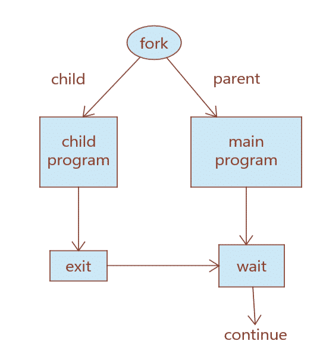

# fork()
Fork system call is used for creating child process the runs cocurently with the parent process.After a new child process is created, both processes will execute the next instruction following the fork() system call. A child process uses the same pc(program counter), same CPU registers, same open files which use in the parent process.

